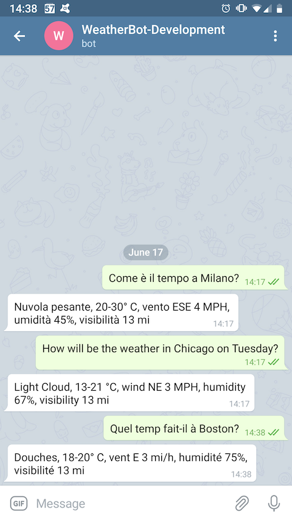

[](https://travis-ci.org/edonosotti/auto-translated-chatbot)
[](https://codebeat.co/projects/github-com-edonosotti-auto-translated-chatbot-master)
[](https://codeclimate.com/github/edonosotti/auto-translated-chatbot/maintainability)

# A multi-language chatbot with automated translation


## Description

This is a sample chatbot application using [`Amazon Lex`](https://aws.amazon.com/lex/)
and [`Amazon Translate`](https://aws.amazon.com/translate/) to automatically translate
incoming requests, process them and translate the responses back to their original language.

It is based on [`claudia-bot-builder`](https://github.com/claudiajs/claudia-bot-builder)
and it is compatible with many
[messaging platforms](https://github.com/claudiajs/claudia-bot-builder#supported-platforms),
such as `Facebook Messenger`, `Telegram`, `Skype`, `Slack` and also `Amazon Echo (Alexa)`.
`claudia-bot-builder` runs on [`Amazon Lambda`](https://aws.amazon.com/lambda/) and
[`Amazon API Gateway`](https://aws.amazon.com/api-gateway/).

Read [this article](https://medium.com/rockedscience/building-a-multi-language-chatbot-with-automated-translations-e2acd053bc5c)
to find out more.

### Caveats

 * This chatbot is meant to prototype a new service or product and run the first iterations
   over it. Although it can scale virtually infinitely using the Amazon platform, for the long
   run it is most probably better to switch to human-curated translations and save on the
   requests issued to Lex and Translate, that are billed per-use.

 * The AWS free tier *SHOULD* allow you to test this bot for free, but please read its terms
   and conditions carefully. You may be charged for AWS services usage. In particular, Lex
   and Translate free tiers only last for 12 months after the first request
   (at the time of writing). So if your account is older than that you may have already
   used up your free tier. Also, all services subject to the free tier do enforce usage
   limits for it. Make sure that your usage is within those limits. Be safe and set an
   [AWS Budget](https://aws.amazon.com/aws-cost-management/aws-budgets/)
   to detect unwanted or excessive charges early on. You are responsible for that.

 * The training data (city names) provided to the chatbot for the `Location` slot is very
   minimal and not enough for the machine learning to properly determine its nature, so
   stick to the provided list of cities when testing the bot. Other cities might not work.


## Requirements

 * `Node.JS v10.x.x`


## Deployment

### `Claudia.JS` notes

This bot is built on `claudia-bot-builder` and uses `Claudia.JS`
for deployments on `AWS`. Since version 2 of the bot framework
was released, `Claudia.JS` was decoupled from the framework
and *MUST* be installed separately. `Claudia.JS` can be either
installed as a *global* package or a *local* dependency.
In order to make the distribution of this package easier for
users and for it to coexist with other versions of `Claudia.JS`,
it has been included as a *local* dependency.

### First deployment

#### 1. Creating the Lex bot

Zip the [`aws/lex/WeatherBot_Export.json`](aws/lex/WeatherBot_Export.json)
file and import it using the `Lex` console:

 1. Sign in to the AWS Management Console and open the [Amazon Lex console, Bots page](https://console.aws.amazon.com/lex/home?#bots:).
 2. From `Actions`, choose `Import`.
 3. From `Import Bot`, choose the `.zip` archive that contains the `JSON` file that contains the bot to import.
 4. Press `Import`.
 5. Press `Build` to build the bot.
 6. Press `Publish` and name the deployment: `Development`.

#### 2. Deploying the backend

Install the required dependencies first:

```
$ npm install
```

Run the following command, replacing `{AWS_REGION}` with your
AWS region of choice:

```
$ ./node_modules/.bin/claudia create \
    --region {AWS_REGION} \
    --api-module bot \
    --version development \
    --policies aws/iam/policies.json \
    --set-env-from-json aws/lambda/env.json
```

If you have multiple AWS profiles configured on your machine,
specify the profile

```
$ AWS_PROFILE={PROFILE_NAME} \
  ./node_modules/.bin/claudia create \
    --region {AWS_REGION} \
    --api-module bot \
    --version development \
    --policies aws/iam/policies.json \
    --set-env-from-json aws/lambda/env.json
```

#### 3. Connecting the bot to a messaging platform

For detailed information on connecting a bot to a messaing
platform, please see the
[`claudia-bot-builder` Hello World Chat Bot doc](https://claudiajs.com/tutorials/hello-world-chatbot.html).

##### Telegram

To get started quickly and test a bot, [`Telegram`](https://telegram.org)
is a very good place to start from. Creating and configuring a bot takes
only [a few steps](https://core.telegram.org/bots#3-how-do-i-create-a-bot).

 1. [Create a bot on Telegram](doc/telegram.md)
 2. Deploy the chatbot as described in **First deployment** above
 3. Run
    ```
    $ ./node_modules/.bin/claudia --configure-telegram-bot
    ```
    and follow the instructions shown on the screen.


## Usage

This bot uses the [`MetaWeather API`](https://www.metaweather.com/api/) to deliver the
weather forecast. You can ask it:

```
How is the weather in Milan?
How will the weather be like in Boston on monday?
```

in any language supported by `Amazon Translate` that can be translated to English.
Please read the **Caveats** paragraph above and see the
[`aws/lex/WeatherBot_Export.json`](aws/lex/WeatherBot_Export.json) file for the list
of cities that are safe to use in this demo.


## Tests

Run:

```
$ npm install
$ npm test
```


## License

This code is released under the [`MIT license`](LICENSE).
Please read it carefully before using it.



