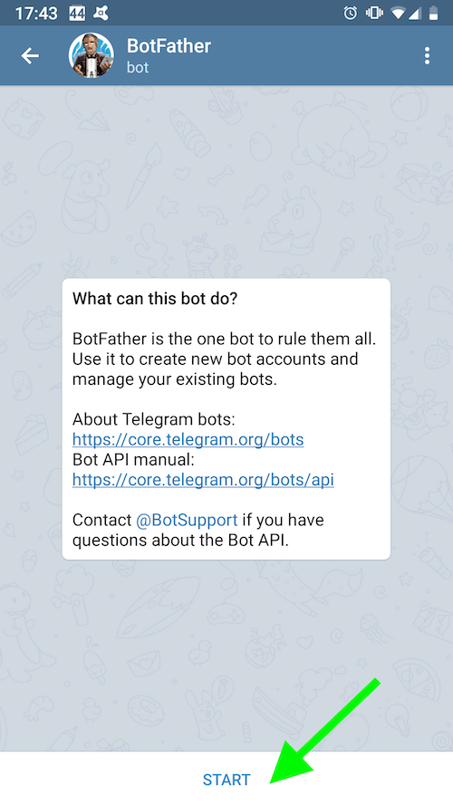
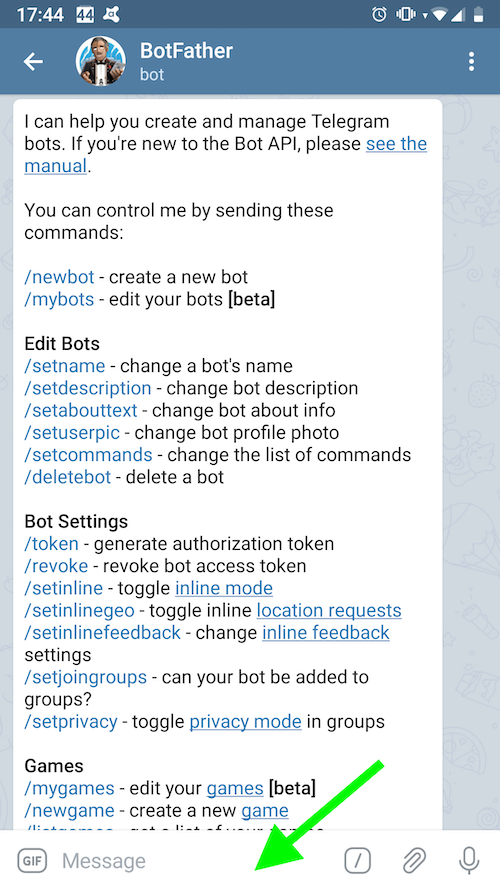
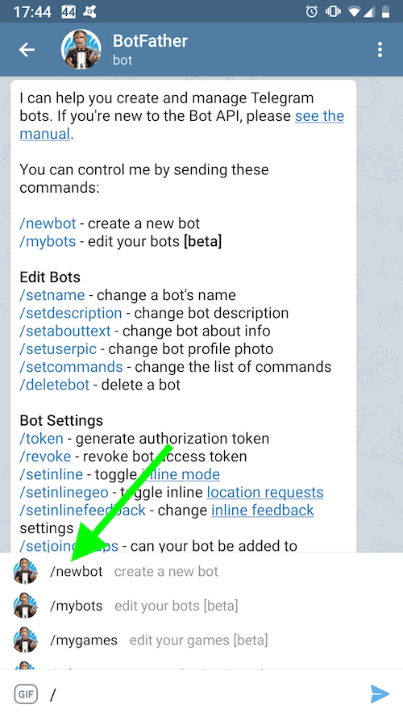
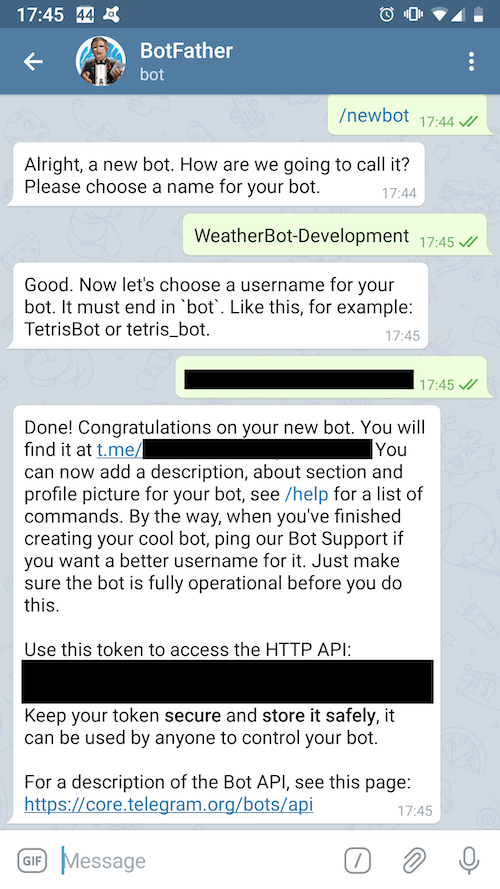

# Creating a Telegram bot - Quick Start

Open the **Telegram** app and initiate a chat with [`BotFather`](https://telegram.me/BotFather), then follow these steps:

Press `START`.

Select the message box and type: `/`, then select: `/newbot`.

Choose a name for the bot and type it in, then copy the `HTTP API Token` and store it in a safe place.

Please find detailed instructions in the [official documentation](https://telegram.me/botfather).
